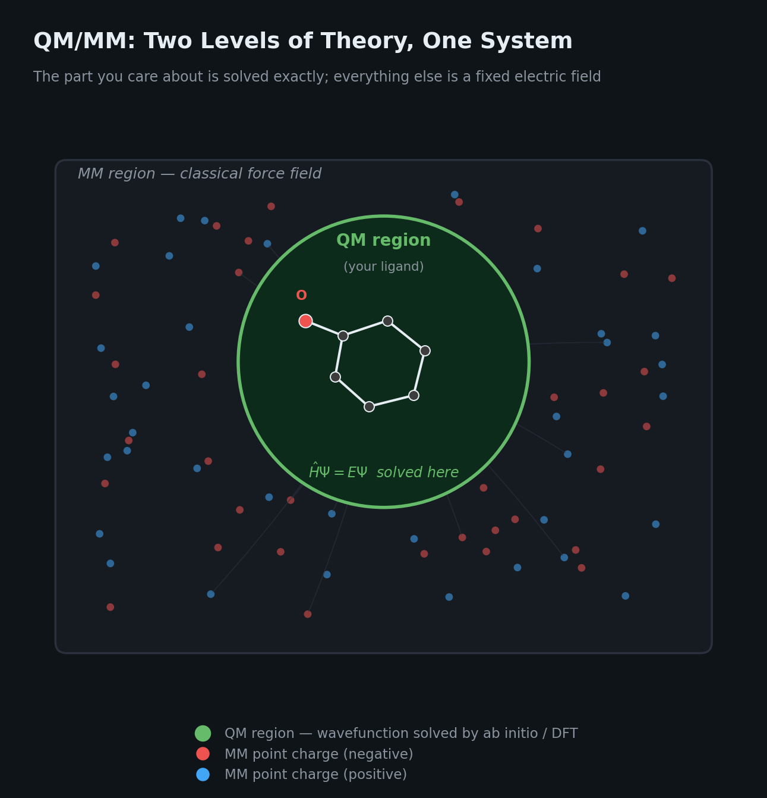
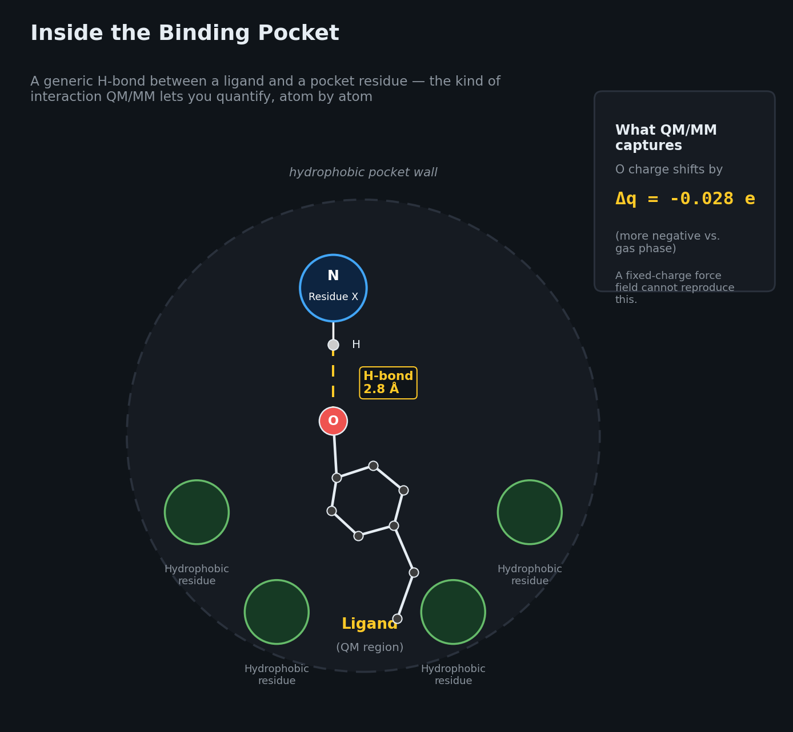
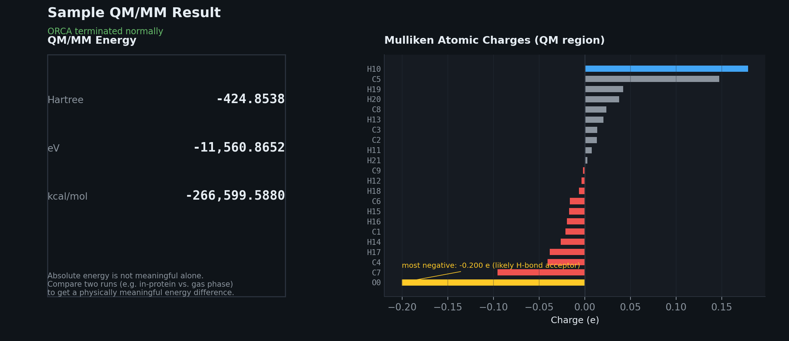
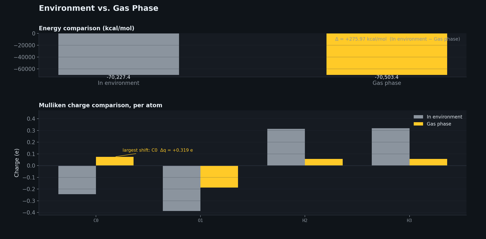

# QM/MM Toolkit

A small, config-driven toolkit for running QM/MM (Quantum Mechanics /
Molecular Mechanics) calculations on protein-ligand systems, and turning the
results into clear, professional figures.

QM/MM combines a fast classical force field for most of a system (a solvated
protein) with an accurate quantum mechanical treatment of the one part you
actually care about (a small molecule bound in the protein's active site). A
field of classical point charges — every protein and water atom outside the
quantum region — sits directly inside the quantum Hamiltonian, so the
molecule's electron density physically responds to its surroundings. That
responsiveness is something a purely classical force field, with its fixed
atomic charges, cannot capture at all.

<p align="center">
  
</p>

This repository wraps that workflow — [OpenMM](https://openmm.org/) for the
molecular mechanics side and [ORCA](https://www.faccts.de/orca/) for the
quantum side — into a small set of scripts driven by one config file, so the
same code runs on any protein and any ligand.

## What it looks like inside the pocket

<p align="center">
  
</p>

This is the physical picture behind every number the toolkit produces: a
ligand's most electronegative atom forming a hydrogen bond with a pocket
residue, with its electron density measurably shifted by that environment —
something only the quantum side of the calculation can show you.

## Real output, visualized

Both figures below are generated directly by `visualize_results.py` from
real (anonymized) ORCA output included in `examples/sample_output/` —
nothing here is mocked up.

**Energy + Mulliken charge summary** for a single QM/MM run — energy in all
three units quantum chemists use, plus a sorted bar chart of every atom's
charge, with the strongest H-bond acceptor called out automatically:

<p align="center">
  
</p>

**Environment vs. gas phase** — the actual point of running QM/MM instead of
a faster classical or gas-phase calculation. The same molecule, once
polarized by its surroundings and once in vacuum, shows a measurable shift in
both energy and per-atom charge:

<p align="center">
  
</p>

## What's in here

```
qmmm-toolkit/
├── config.yaml.example       # copy to config.yaml and edit for your system
├── scripts/
│   ├── check_setup.py        # verifies OpenMM + ORCA are installed correctly
│   ├── run_qmmm.py            # runs the QM/MM single-point calculation
│   ├── visualize_results.py  # turns ORCA output into the charts above
│   ├── diagram.py             # generates the schematic illustrations above
│   ├── orca_parser.py        # standalone ORCA-output parser (energy + charges)
│   └── qmmm_common.py        # shared config-loading / ORCA-discovery helpers
├── examples/
│   └── sample_output/        # real ORCA output + figures, so you can try
│                              # the visualizer immediately without running ORCA
└── docs/
    ├── images/                # the two illustrations shown above
    ├── workflow.md            # full pipeline: PDB file -> QM/MM result
    └── file_reference.md      # what every generated file is and means
```

## Quick start

Try the visualizer right away on the included sample data — no setup
required:

```bash
pip install -r requirements.txt

python scripts/visualize_results.py \
  --orca-out examples/sample_output/qmmm_system.out \
  --title "Sample QM/MM Result"

python scripts/visualize_results.py \
  --orca-out examples/sample_output/environment_example.out \
  --compare-to examples/sample_output/gas_phase_example.out \
  --labels "In environment" "Gas phase"
```

You can also regenerate the two schematic illustrations, optionally with
your own residue/ligand labels and numbers:

```bash
python scripts/diagram.py --out-dir docs/images \
  --residue "Gln102" --ligand-label "Ligand" --distance 2.8 --delta-q -0.028
```

## Running it on your own system

This requires [OpenMM](https://openmm.org/) and
[ORCA](https://www.faccts.de/orca/) (free for academic use) installed
locally, plus a system prepared in [CHARMM-GUI](https://charmm-gui.org/).
The full pipeline — from downloading a PDB file to a finished QM/MM
result — is in **[docs/workflow.md](docs/workflow.md)**.

Once you have a CHARMM-GUI-prepared, equilibrated system:

```bash
# 1. Copy and edit the config for your protein/ligand
cp config.yaml.example config.yaml
# edit config.yaml: set paths.charmm_gui_dir and ligand.resname / ligand.charge

# 2. Confirm your environment is set up correctly
python scripts/check_setup.py

# 3. Run the QM/MM calculation
python scripts/run_qmmm.py

# 4. Visualize the result
python scripts/visualize_results.py --output-dir qmmm_output
```

Nothing in `scripts/` needs to change between projects — every
system-specific detail (file paths, ligand name, net charge, QM method,
core count) lives in `config.yaml`.

## How it works

1. **Load the system.** `run_qmmm.py` reads the CHARMM-GUI topology (`.psf`)
   and equilibrated coordinates (`.pdb`) into OpenMM.
2. **Select the QM region.** By default, every atom belonging to your
   ligand's residue name. Optionally, nearby protein residues too (see
   `qm_region.expand_to_nearby_residues` in the config), if you want a key
   H-bonding side chain treated quantum-mechanically instead of classically.
3. **Extract MM point charges.** Every other atom in the system — the rest of
   the protein, all the water, any ions — becomes a fixed classical point
   charge.
4. **Write and run an ORCA input.** The point charges are embedded directly in
   ORCA's Hamiltonian via `%pointcharges`. This is the actual QM/MM coupling:
   the quantum region's wavefunction is solved *in the presence of* the
   surrounding electric field, so it can polarize in response to it.
5. **Parse and visualize.** The script extracts the total energy (Hartree,
   eV, kcal/mol) and the Mulliken atomic charges, and `visualize_results.py`
   turns those into the figures shown above.

## Requirements

- Python 3.10+
- [OpenMM](https://openmm.org/) (best installed via conda:
  `conda install -c conda-forge openmm`)
- [ORCA](https://www.faccts.de/orca/) 5 or 6, with the `orca` binary on
  your `PATH`
- Everything else: `pip install -r requirements.txt`

## License

MIT — see [LICENSE](LICENSE).
